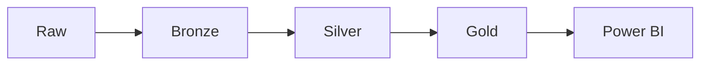

# Pipeline de Dados Educacionais

Pipeline reproduzível de Engenharia de Dados e Analytics Engineering para dados
oficiais do Inep. O projeto organiza fontes educacionais em camadas
`Raw -> Bronze -> Silver -> Gold` e entrega um modelo analítico consumido no
Power BI.

## Visão Geral

Indicadores históricos:

- SAEB
- IDEB
- Rendimento Escolar
- Taxa de Distorção Idade-Série (TDI)

Escopo da série histórica:

| Dimensão | Recorte |
|---|---|
| Período | 2007-2023 |
| Abrangência | 27 UFs |
| Rede | Pública |
| Etapas | Anos Iniciais e Anos Finais |

A Prova Nacional Docente (PND) 2025 é tratada como análise complementar e
separada da série histórica.

## Destaques Técnicos

- múltiplos formatos de origem: XLS, XLSX, XLSB, CSV e TXT;
- 54 arquivos Raw inventariados;
- hashes SHA-256 para rastreabilidade dos insumos;
- camadas Raw, Bronze, Silver e Gold;
- validações independentes por camada;
- modelo dimensional com 5 dimensões e 5 fatos;
- Power BI Desktop com medidas DAX versionadas;
- documentação metodológica e auditorias por fonte;
- auditoria específica do SAEB 2023;
- classificação PND baseada em `NT_OBJ`, conforme documentação oficial usada no
  projeto.

## Arquitetura



| Camada | Função |
|---|---|
| Raw | Arquivos brutos obtidos das fontes oficiais, com convenção de nomenclatura local documentada |
| Bronze | Ingestão técnica e preservação rastreável dos dados lidos |
| Silver | Padronização semântica, harmonização e aplicação do recorte analítico |
| Gold | Modelo dimensional em Parquet para consumo analítico |
| Power BI | Modelo semântico, medidas DAX e visualizações |

## Dashboard Power BI

O arquivo Power BI Desktop está em:

[powerbi/pbix/analise dos indicadores da educação.pbix](powerbi/pbix/analise%20dos%20indicadores%20da%20educação.pbix)

Medidas e documentação do modelo:

- [powerbi/medidas_power_bi.dax](powerbi/medidas_power_bi.dax)
- [docs/modelagem_power_bi.md](docs/modelagem_power_bi.md)

Prévia das páginas:

<p>
  
  
</p>

<p>
  
  
</p>

[Ver todas as páginas do dashboard](prints/)

## Modelo Gold

Tabelas dimensionais:

| Tabela | Registros |
|---|---:|
| `DIM_UF` | 27 |
| `DIM_TEMPO` | 18 |
| `DIM_ETAPA` | 2 |
| `DIM_AREA_PND` | 17 |
| `DIM_MUNICIPIO` | 750 |

Tabelas fato:

| Tabela | Registros |
|---|---:|
| `FATO_RENDIMENTO` | 2.754 |
| `FATO_TDI` | 918 |
| `FATO_IDEB` | 486 |
| `FATO_SAEB` | 972 |
| `FATO_PND` | 759.140 |

A validação global confirma grãos, domínios e integridade referencial antes do
consumo no Power BI.

## Fontes

Os dados são provenientes de bases oficiais do Instituto Nacional de Estudos e
Pesquisas Educacionais Anísio Teixeira (Inep/MEC).

| Base | Período | Link oficial |
|---|---:|---|
| SAEB — Microdados | 2007-2023 | [Inep/MEC — Microdados do SAEB](https://www.gov.br/inep/pt-br/acesso-a-informacao/dados-abertos/microdados/saeb) |
| SAEB — Resultados agregados | 2007-2023 | [Inep/MEC — Resultados do SAEB](https://www.gov.br/inep/pt-br/areas-de-atuacao/avaliacao-e-exames-educacionais/saeb/resultados) |
| IDEB — Resultados | 2007-2023 | [Inep/MEC — Resultados do IDEB](https://www.gov.br/inep/pt-br/areas-de-atuacao/pesquisas-estatisticas-e-indicadores/ideb/resultados) |
| Taxas de Rendimento Escolar | 2007-2023 | [Inep/MEC — Taxas de Rendimento Escolar](https://www.gov.br/inep/pt-br/acesso-a-informacao/dados-abertos/indicadores-educacionais/taxas-de-rendimento-escolar) |
| Taxas de Distorção Idade-Série (TDI) | 2007-2023 | [Inep/MEC — Taxas de Distorção Idade-Série](https://www.gov.br/inep/pt-br/acesso-a-informacao/dados-abertos/indicadores-educacionais/taxas-de-distorcao-idade-serie) |
| Prova Nacional Docente (PND) — Microdados | 2025 | [Inep/MEC — Microdados da PND](https://www.gov.br/inep/pt-br/acesso-a-informacao/dados-abertos/microdados/pnd) |

O Inep/MEC permanece como fonte primária. A cópia abaixo é apenas uma cópia
organizada de conveniência da camada Raw:

[Google Drive — Raw organizada](https://drive.google.com/file/d/1Jm2v8Er4m5dgjOLOLLcaNssn_YN1Wsja/view?usp=sharing)

O inventário completo, os hashes SHA-256 e a convenção de nomes locais estão em
[docs/fontes_dados.md](docs/fontes_dados.md).

## Como Reproduzir

### 1. Clone

```bash
git clone <url-do-repositorio>
cd portfolio-pipeline-dados-educacionais
```

### 2. Ambiente Python

Windows PowerShell:

```powershell
python -m venv .venv
.\.venv\Scripts\Activate.ps1
python -m pip install -r requirements.txt
```

Linux/macOS:

```bash
python3 -m venv .venv
source .venv/bin/activate
python -m pip install -r requirements.txt
```

### 3. Dados Raw

A pasta `data/raw` não é versionada no Git.

Para reproduzir o projeto, mantenha a estrutura esperada em `data/raw/...` por
uma destas opções:

- baixar os arquivos nas fontes oficiais seguindo [docs/fontes_dados.md](docs/fontes_dados.md);
- usar a cópia de conveniência da Raw organizada no Google Drive.

### 4. Verificar Integridade da Raw

```bash
python scripts/gerar_manifesto_raw.py --check
```

Esse comando apenas verifica os arquivos locais contra o manifesto versionado.
Ele não reescreve `docs/fontes_dados.md`, `docs/fontes_dados.csv` nem
`docs/raw_checksums_sha256.txt`.

### 5. Executar o Pipeline Completo

```bash
python src/pipeline.py full
```

O comando executa Bronze, Silver, Gold e validações. Em um clone limpo, a
execução completa exige que os arquivos Raw estejam disponíveis em `data/raw`.

### 6. Outras Opções

```bash
python src/pipeline.py bronze
python src/pipeline.py silver
python src/pipeline.py gold
python src/pipeline.py validate-gold
python src/pipeline.py --list
python src/pipeline.py full --dry-run
```

`full --dry-run` lista a sequência completa e valida a existência dos scripts
referenciados, sem executar transformações analíticas.

## Resultado Validado

A validação global da Gold retorna:

```text
MODELO DIMENSIONAL GOLD: OK
```

Cardinalidades confirmadas:

```text
DIM_UF: 27
DIM_TEMPO: 18
DIM_ETAPA: 2
DIM_AREA_PND: 17
DIM_MUNICIPIO: 750
FATO_RENDIMENTO: 2.754
FATO_TDI: 918
FATO_IDEB: 486
FATO_SAEB: 972
FATO_PND: 759.140
```

## Documentação

- [docs/fontes_dados.md](docs/fontes_dados.md)
- [docs/camada_bronze.md](docs/camada_bronze.md)
- [docs/camada_silver.md](docs/camada_silver.md)
- [docs/camada_gold.md](docs/camada_gold.md)
- [docs/definicao_rede_publica.md](docs/definicao_rede_publica.md)
- [docs/modelagem_power_bi.md](docs/modelagem_power_bi.md)
- [docs/auditoria/](docs/auditoria/)

## Escopo Temporal

A versão atual das séries históricas permanece em 2007-2023 para manter
coerência entre SAEB, IDEB, Rendimento Escolar e TDI.

O fato de páginas oficiais atualmente possuírem edições de 2025 não altera
automaticamente o escopo desta versão. A PND 2025 permanece como análise
complementar.

## Observações

Os arquivos de dados são ignorados por padrão no Git por tamanho e por serem
fontes locais ou artefatos reproduzíveis. O arquivo `.pbix` foi mantido como
entrega visual do portfólio; em repositórios maiores, recomenda-se avaliar Git
LFS.

## Licença e Citação

Este projeto é disponibilizado sob a
[PolyForm Noncommercial License 1.0.0](LICENSE).

Usos não comerciais, incluindo estudo, pesquisa, uso acadêmico, modificação e
redistribuição não comercial, são permitidos nos termos da licença. Uso
comercial não é autorizado por esta licença e depende de autorização ou
licenciamento separado pelo autor.

O arquivo [LICENSE](LICENSE) define as condições jurídicas de utilização do
código. O arquivo [CITATION.cff](CITATION.cff) registra os metadados de autoria
e orienta a citação acadêmica do projeto.
